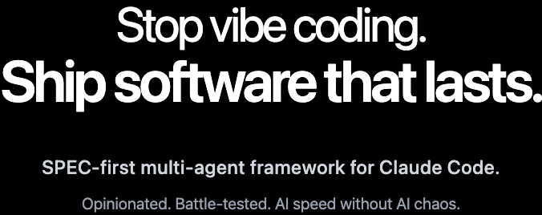

<p align="center">
  <a href="https://humaninloop.dev">
    
  </a>
</p>

<p align="center">
  <strong>Stop vibe coding. Ship software that lasts.</strong>
</p>

<p align="center">
  <a href="https://humaninloop.dev">Website</a> •
  <a href="#quick-start">Quick Start</a> •
  <a href="./ROADMAP.md">Roadmap</a> •
  <a href="./CHANGELOG.md">Changelog</a>
</p>

---

## What is HumanInLoop?

HumanInLoop is a Claude Code plugin that enforces **specification-driven development**—ensuring architectural decisions are made by humans before AI writes code.

Instead of letting AI improvise your architecture, you guide it through a structured workflow:

```
Idea → Specification → Plan → Tasks → Implementation
```

Every step produces artifacts you can review, refine, and approve before moving forward.

---

## Quick Start

### 1. Add the marketplace

```bash
/plugin marketplace add deepeshBodh/human-in-loop
```

### 2. Install the plugin

```bash
/plugin install humaninloop
```

### 3. Set up your project

```bash
/humaninloop:setup
```

This creates your project constitution—the standards and conventions that guide all future specifications.

### 4. Create your first spec

```bash
/humaninloop:specify add user authentication with email and password
```

---

## The Workflow

| Stage | Command | What You Get |
|-------|---------|--------------|
| **Setup** | `/humaninloop:setup` | Project constitution with your standards |
| **Specify** | `/humaninloop:specify` | Structured spec with user stories and requirements |
| **Plan** | `/humaninloop:plan` | Implementation plan with data models and contracts |
| **Tasks** | `/humaninloop:tasks` | Ordered task list with TDD cycles |
| **Audit** | `/humaninloop:audit` | Quality analysis across all artifacts |
| **Implement** | `/humaninloop:implement` | Guided implementation with progress tracking |

Each command produces artifacts you review before the next step. You stay in control.

---

## What's Included

### 6 Commands
The full specify → plan → tasks → implement lifecycle.

### 17 Skills
Claude automatically invokes these when relevant—authoring requirements, analyzing codebases, designing APIs, running verification tests, and more.

### 6 Specialized Agents
Focused responsibilities: requirements analyst, devil's advocate, plan architect, principal architect, task architect, testing agent.

See the [plugin documentation](./plugins/humaninloop/README.md) for full details.

---

## Documentation

| Resource | Description |
|----------|-------------|
| [Roadmap](./ROADMAP.md) | Vision and planned features |
| [Changelog](./CHANGELOG.md) | Release history |
| [Plugin README](./plugins/humaninloop/README.md) | Detailed command and skill reference |

---

## For Plugin Developers

This repository serves as a reference implementation for Claude Code plugins. If you're building your own plugins, you can learn from:

### Repository Structure

```
human-in-loop/
├── plugins/humaninloop/
│   ├── .claude-plugin/plugin.json   # Plugin manifest
│   ├── commands/                     # Slash command definitions
│   ├── agents/                       # Specialized agent definitions
│   ├── skills/                       # Model-invoked skills
│   ├── templates/                    # Workflow templates
│   └── scripts/                      # Shell utilities
├── docs/
│   ├── decisions/                    # Architecture Decision Records
│   ├── claude-plugin-documentation.md
│   └── agent-skills-documentation.md
└── specs/                            # Feature specifications (dogfooding)
```

### Key Resources

- [Claude Code Plugin Documentation](./docs/claude-plugin-documentation.md) - Complete technical reference
- [Agent Skills Documentation](./docs/agent-skills-documentation.md) - How skills work
- [Architecture Decisions](./docs/decisions/) - ADRs explaining design choices

---

## Contributing

See [CONTRIBUTING.md](./CONTRIBUTING.md) for guidelines.

---

## License

MIT - See [LICENSE](./LICENSE)
